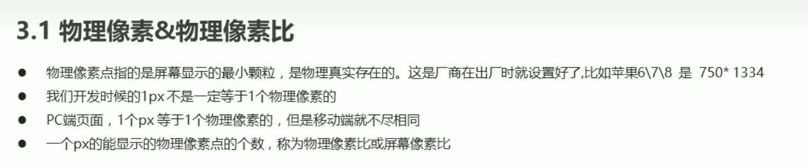
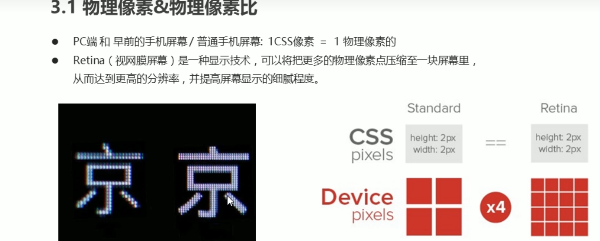
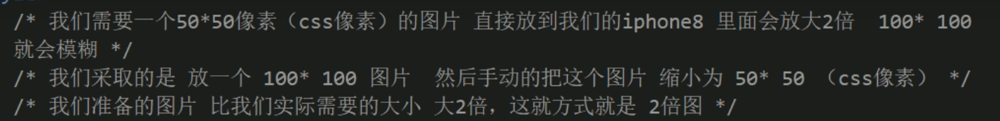
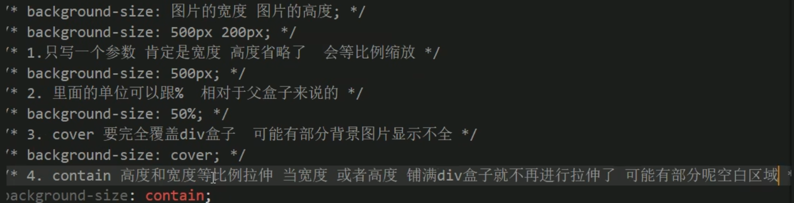
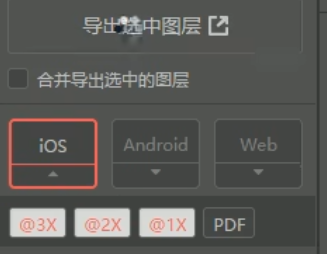

[TOC]

# 视口

视口就是浏览器的显示内容的屏幕区域。视口可以分为布局视口、视觉视口、理想视口。

布局视口

latout viewport 不适合手机

### 视觉视口

用户正在看到的网站的区域

### 理想视口 

ideal viewport 以后的布局尽量是理想视口

### meta视口

- 视口宽度和设备保持一致
- 视口的默认缩放比列1.0
- 不允许用户自行缩放
- 最大允许的缩放比例1.0
- 最小允许的缩放比例1.0

    <meta name="viewport" content="width=device-width, user-scalable=no, initial-scale=1.0, maximum-scale=1.0, minimum-scale=1.0, user-scalable=0">
#### 二倍图

物理像素 物理像素比

开发时1px不一定等于一个物理像素的

使用倍图来解决图像模糊

给100*100的图片加上宽度和高度50px

---

### 背景缩放

background-size

用cutterman可以导出倍图

