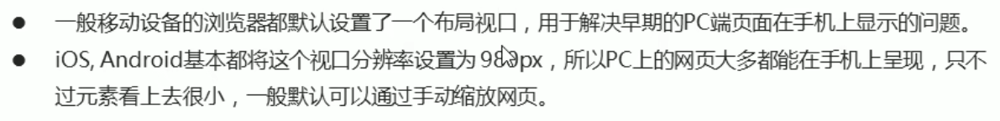
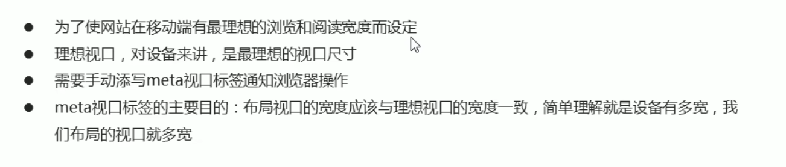

# 视口

视口就是浏览器的显示内容的屏幕区域。视口可以分为布局视口、视觉视口、理想视口。

#### 布局视口

latout viewport 不适合手机

#### 视觉视口

用户正在看到的网站的区域

#### 理想视口 

ideal viewport 以后的布局尽量是理想视口

#### meta视口

视口宽度和设备保持一致

视口的默认缩放比列1.0

不允许用户自行缩放

最大允许的缩放比例1.0

最小允许的缩放比例1.0