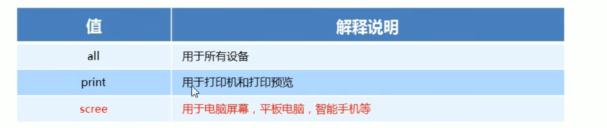
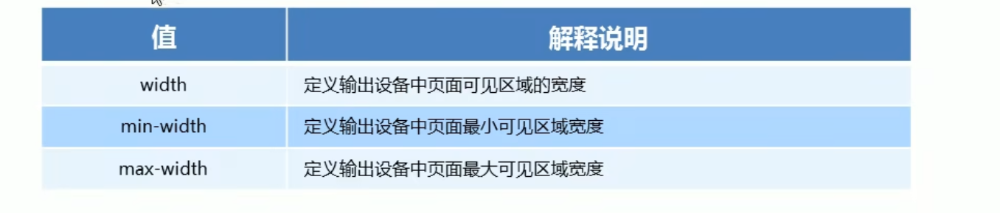
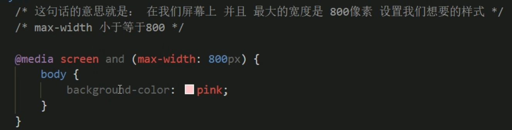

[TOC]

# rem布局

rem是一个单位 root em

# 媒体查询

使用@media查询 可以针对不同的媒体类型定义不同的样式

@media可以针对不同的屏幕尺寸设置不同的样式

当你重置浏览器大小的过程中 页面也会根据浏览器的宽度和高度重新渲染页面

当你针对很多苹果手机 安卓手机 平板等设备都要用到媒体查询

@media mediatype and|not|only(media feature)

mediatype类型

关键字 

媒体特性

!1658478679141](rem布局.assets/1658478679141.png)

